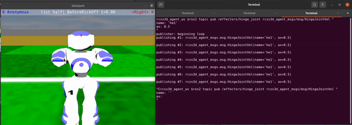

.. Rcss3d Agent documentation master file, created by
   sphinx-quickstart on Sat Jan 29 13:50:21 2022.
   You can adapt this file completely to your liking, but it should at least
   contain the root `toctree` directive.

Nao Soccer Sim
==============

This project consists of ROS2 packages that allow launching an agent soccer player
in the SimSpark soccer simulator, and send commands and receive sensory data
as if you are interacting with a physical NAO robot.

The project is hosted on `Github`_ by ROS Sports.

.. toctree::
   :hidden:
   :maxdepth: 2

   installation
   rcss3d_agent_basic
   rcss3d_agent

.. _Github: https://github.com/ijnek/naosoccer_sim
