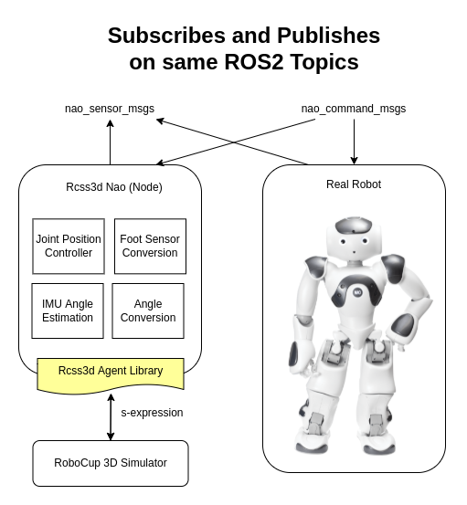
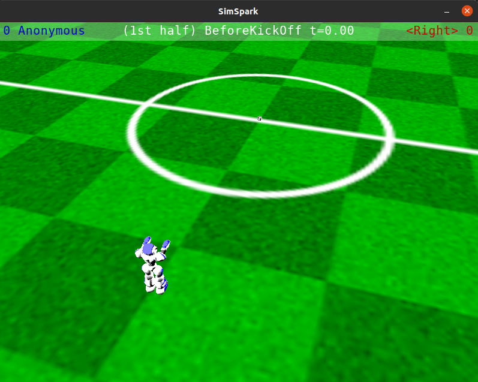
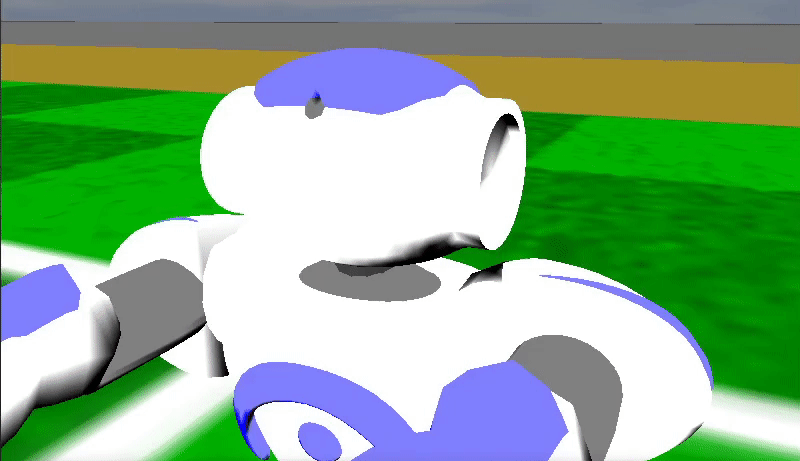

Rcss3d Agent
############

Rcss3d Agent is a general ROS2 C++ library that handles the network connection and parsing/packing
of data from/to the format that the simulator understands (s-expressions).

Introduction
************

For 3D simulation teams, the provided Rcss3d Agent Basic node which is built on top of
the Rcss3d Agent library is likely all that is needed.
Teams from other leagues such as the humanoid league or SPL, can use the general
library and provide their own pub/sub implementations to match those used on their robots.

An example usage of this library is in the `rcss3d_nao`_ package that
publishes/subscribes using interfaces specific to the Nao (`nao_command_msgs`_ and
`nao_sensor_msgs`_), such that a real Nao robot can be substituted out for a simulated one
seamlessly.

Rcss3d Nao attempts to bridge the discrepancy between the simulator and a physical robot.

For example, a physical Nao robot accepts joint position commands, but the simulator accepts joint
velocity commands. Rcss3d Nao implements a joint velocity controller to convert the requested
joint position to a joint velocity that the simulator accepts.

Usage
*****

To use this package in your ament project, you must declare it as a dependency in your package, as following:

.. code-block:: cpp

  // In your package.xml
  <depend>rcss3d_agent</depend>

  // In your CMakeLists.txt
  find_package(rcss3d_agent REQUIRED)
  ament_target_dependencies(your_target rcss3d_agent)

To use the package in a C++ file, simply include the following header file:

.. code-block:: cpp

  #include "rcss3d_agent/rcss3d_agent.hpp"

API
***

The **rcss3d_agent::Rcss3dAgent** class is the core of the library.
Constructing an Rcss3dAgent object will launch a new agent in the simulator.
Destroying the object will disconnect the agent from the simulator.

Constructor
===========

The constructor takes exactly one parameter of type ``rcss3d_agent::Params``. An example
is given below:

.. code-block:: cpp

  // Example parameters
  std::string model = "rsg/agent/nao/nao.rsg" // Rsg robot model relative to /usr/local/share/rcssserver3d/
  std::string rcss3d_host = "127.0.0.1";      // IP Address of Simulation Server (default: 127.0.0.1)
  int rcss3d_port = 3100;                     // Port of Simulation Server (default: 3100)
  std::string team = "ROS Sports";            // Team name
  int unum = 3;                               // Player number

  // Construct rcss3d_agent::Params
  rcss3d_agent::Params params{model, rcss3d_host, rcss3d_port, team, unum};

  // Construct rcss3d_agent::Rcss3dAgent
  rcss3d_agent::Rcss3dAgent rcss3dAgent{params};

The agent is connected to the simulator through localhost(:code:`127.0.0.1`) on port :code:`3100` by
default.

.. important::

  :code:`params` **must outlive** :code:`rcss3dAgent`, or
  :code:`rcss3dAgent` will have a dangling reference to the :code:`params` object which
  will cause undefined behaviour.

Perceptor callback
==================

To be notified about perceptor information, you must register a callback function using the
:code:`registerPerceptCallback` method.

.. code-block:: cpp

  // Register callback methods
  void registerPerceptCallback(
      std::function<void(const rcss3d_agent_msgs::msg::Percept &)> callback);

Your callback function must accept a
:code:`const rcss3d_agent_msgs::msg::Percept &` and have no return value.

.. code-block:: cpp

  // A callback definition somewhere
  void perceptCallback(const rcss3d_agent_msgs::msg::Percept & percept);

  // Registering the callback
  rcss3dAgent.registerPerceptCallback(perceptCallback);

.. tip::

  If you're registering a class method as the callback from within the class,
  you can use :code:`std::bind` with :code:`std::placeholders`, as following:

  .. code-block:: cpp

    rcss3dAgent.registerPerceptCallback(
      std::bind(&YourClass::perceptCallback, this, std::placeholders::_1));

----

The `rcss3d_agent_msgs/msg/Percept`_ parameter contains information sent
from the simulator to the agent in a simulation cycle, and contains:

* Sensor Data - gyroscope, joints, FSRs, accelerometers
* Vision Data - ball, field lines, flags, goalposts, other players
* Game State - time, playmode
* Agent State - temperature, battery
* Messages from other players

An example of a callback that prints the simulator time received
from the simulator to std::cout:

.. code-block:: cpp

  #include <iostream>

  void perceptCallback(const rcss3d_agent_msgs::msg::Percept & percept)
  {
    std::cout << "Time: " << percept.game_state.time << std::endl;
  }

.. seealso::

  See `rcss3d_agent_msgs/msg/Percept`_ for msg field details

Effector methods
================

The following are the four methods to effect the agent:

.. code-block:: cpp

  void sendBeam(const rcss3d_agent_msgs::msg::Beam & b);
  void sendHingeJointVel(const rcss3d_agent_msgs::msg::HingeJointVel & j);
  void sendUniversalJointVel(const rcss3d_agent_msgs::msg::UniversalJointVel & j);
  void sendSay(const rcss3d_agent_msgs::msg::Say & s);
  void sendSynchronize();

Detailed explanations and usages are given below.

Beam
----

The `Beam Effector`_ allows a player to position itself on the field before the start of each half.
The following method is used for this:

.. code-block:: cpp

  void sendBeam(const rcss3d_agent_msgs::msg::Beam & b);

Let's take a look at an example where we are trying to move the robot to four metres
behind and facing the centre circle. The beaming coordinate of the robot is
(-4.0, 0.0, 0.0). The method will be used as below:

.. code-block:: cpp

  // Create rcss3d_agent_msgs::msg::Beam
  rcss3d_agent_msgs::msg::Beam beam;
  beam.x = -4.0;

  // Send Beam
  rcss3dAgent.sendBeam(beam);

In the simulator, you should see the robot has moved to the requested pose as below:

Hinge Joint
-----------

The `Hinge Joint Effector`_ lets you request a velocity for a hinge joint from your
robot. The following method is used for this:

.. code-block:: cpp

  void sendHingeJointVel(const rcss3d_agent_msgs::msg::HingeJointVel & j);

Let's take a look at an example, where we will set the velocity of the head yaw (ie. :code:`he1`)
to 1.0 rad/s. The method will be used as below:

.. code-block:: cpp

  // Create rcss3d_agent_msgs::msg::HingeJointVel
  rcss3d_agent_msgs::msg::HingeJointVel hingeJointVel;
  hingeJointVel.name = "he1";
  hingeJointVel.ax = 1.0;

  // Send HingeJointVel
  rcss3dAgent.sendHingeJointVel(hingeJointVel);

In the simulation, you should see the robot's head yaw obtain a velocity of 1.0 rad/s and turn
left until it hits the joint limit as following:

.. seealso::

  For a list of the name of hinge joint effectors of the Nao robot,
  refer to RoboCup 3D Simulation League's `Nao model`_.

Universal Joint
---------------

The `Universal Joint Effector`_ lets you request a velocity for a universal joint from your
robot. The following method is used for this:

.. code-block:: cpp

  void sendUniversalJointVel(const rcss3d_agent_msgs::msg::UniversalJointVel & j);

The default Nao robot model doesn't have any universal joints. The example below shows how to move
the universal shoulder joint of SimSpark's `SoccerBot`_:

Let's take a look at an example, where we will set the velocity of the left shoulder-body
joint (ie. :code:`lae1_2`) for the SoccerBot to 1.0 rad/s and -1.0 rad/s around the first and second
axis:

.. code-block:: cpp

  // Create rcss3d_agent_msgs::msg::UniversalJointVel
  rcss3d_agent_msgs::msg::UniversalJointVel universalJointVel;
  universalJointVel.name = "lae1_2";
  universalJointVel.ax1 = 1.0;
  universalJointVel.ax2 = -1.0;

  // Send UniversalJointVel
  rcss3dAgent.sendUniversalJointVel(universalJointVel);

Say
---

The `Say Effector`_ permits communication among agents by broadcasting messages. Be sure to read
about this effector's dual, the `Hear Perceptor`_, as it details restrictions upon what message
content may be sent, and under what circumstances other agents will actually hear your messages.

Let's take a look at an example, where we will send a message (ie. :code:`helloworld`) to teammates:

.. code-block:: cpp

  // Create rcss3d_agent_msgs::msg::Say
  rcss3d_agent_msgs::msg::Say say;
  say.message = "helloworld";

  // Send Say
  rcss3dAgent.sendSay(say);

Synchronize
-----------

.. note::

  This effector has no effect if simulator is running with the default real-time mode.

The `Synchronize Effector`_ must be used if the simulator is running with `Agent Sync Mode`_.
In Agent Sync Mode, agents must send a synchronize message at the end of each simulation
cycle. Note that the server ignores this command if it is received in Real-Time Mode, so it is
safe to configure your agent to always call the synchronize effector.

To use, simply call the :code:`sendSynchronize()` method as below:

.. code-block:: cpp

  rcss3dAgent.sendSynchronize();

When running in Agent Sync Mode, if the simulator with the agent moves forward in time,
you are calling this effector correctly.

.. _rcss3d_nao: https://github.com/ijnek/rcss3d_nao
.. _nao_command_msgs: https://index.ros.org/p/nao_command_msgs/
.. _nao_sensor_msgs: https://index.ros.org/p/nao_sensor_msgs/
.. _rcss3d_agent_msgs/msg/Percept: https://github.com/ros-sports/rcss3d_agent/blob/rolling/rcss3d_agent_msgs/msg/Percept.msg
.. _Beam Effector: https://gitlab.com/robocup-sim/SimSpark/-/wikis/Effectors#beam-effector
.. _Hinge Joint Effector: https://gitlab.com/robocup-sim/SimSpark/-/wikis/Effectors#hingejoint-effector
.. _Nao model: https://gitlab.com/robocup-sim/SimSpark/-/wikis/Models#equipment
.. _Universal Joint Effector: https://gitlab.com/robocup-sim/SimSpark/-/wikis/Effectors#universaljoint-effector
.. _Soccerbot: https://gitlab.com/robocup-sim/SimSpark/-/wikis/Models#soccerbot
.. _Say Effector: https://gitlab.com/robocup-sim/SimSpark/-/wikis/Effectors#say-effector
.. _Hear Perceptor: https://gitlab.com/robocup-sim/SimSpark/-/wikis/Perceptors#hear-perceptor
.. _Synchronize Effector: https://gitlab.com/robocup-sim/SimSpark/-/wikis/Effectors#synchronize-effector
.. _Agent Sync Mode: https://gitlab.com/robocup-sim/SimSpark/-/wikis/Agent-Sync-Mode
