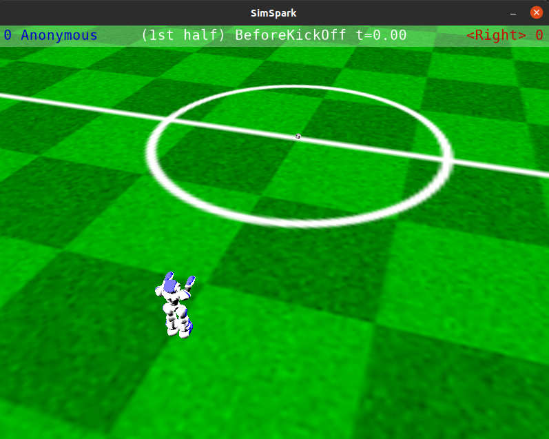

Rcss3d Agent Basic
##################

Rcss3d Agent Basic is a ROS2 Component that can run as a standalone application. The term
**Basic** comes from the node closely mimicking the interface provided by SimSpark.
Custom ROS2 interfaces are used with no attempt at converting the interfaces to those
you would probably use to communicate with a real robot. To write a node that matches
interfaces used by a real robot, see :doc:`rcss3d_agent`

Launching a Player
******************

.. note::

  Instructions here assume you have `RoboCup Soccer Simulation running`_.

To run rcss3d_agent_basic as a standalone application, run:

.. code-block:: console

  ros2 run rcss3d_agent_basic rcss3d_agent_basic

Moving the simulator camera around with WASD keys and mouse, 
you should see your robot at the corner of the field, as below:

Beaming the Robot
*****************

The `Beam Effector`_ allows a player to position itself on the field before the start of each half.
In this example, we will move the robot to four metres behind and facing the centre circle. The
coordinate of the robot after beamed will be (-4.0, 0.0, 0.0).

In a new terminal, run:

.. code-block:: console

  ros2 topic pub --once /effectors/beam rcss3d_agent_msgs/msg/Beam "
  x: -4.0
  y: 0.0
  rot: 0.0
  "

In the simulator, you should see the robot has moved to the requested pose as below:

Moving a Hinge Joint
********************

To send a hinge joint command to the simulated robot, you must publish
a ``rcss3d_agent_msgs/msg/HingeJointVel`` msg on the ``/effectors/hinge_joint`` topic.

In this example, we will set the velocity of the head yaw to be 1.0. In a new terminal, run:

.. code-block:: console

  ros2 topic pub --once /effectors/hinge_joint rcss3d_agent_msgs/msg/HingeJointVel "
  name: 'he1'
  ax: 1.0
  "

In the simulation, you should see the robot turn its head left until it hits the joint limit as
following:

.. seealso::

  For a list of the name of hinge joint effectors, refer to RoboCup 3D Simulation League's
  `Nao model`_.

Moving a Universal Joint
************************

To send a universal joint command to the simulated robot, you must publish
a ``rcss3d_agent_msgs/msg/UniversalJointVel`` msg on the ``/effectors/universal_joint`` topic.

The default Nao robot model doesn't have any universal joints. The example below shows how to move
the universal shoulder joint of SimSpark's `SoccerBot`_:

.. code-block:: console

  ros2 topic pub --once /effectors/hinge_joint rcss3d_agent_msgs/msg/HingeJointVel "
  name: 'lae1_2'
  ax1: 1.0
  ax2: -1.0
  "

Communicating with Other Agents
*******************************

The `Say Effector`_ permits communication among agents by broadcasting messages. Be sure to read
about this effector's dual, the `Hear Perceptor`_, as it details restrictions upon what message 
content may be sent, and under what circumstances other agents will actually hear your messages.

In this example, we will send a msg containing the string "helloworld":

.. code-block:: console

  ros2 topic pub --once /effectors/say rcss3d_agent_msgs/msg/Say "message: 'helloworld'"

Topics Used
***********

In a new terminal, run:

.. code-block:: console

  ros2 node info /rcss3d_agent

You will see the topics the node is subscribed to / publishes to, similar to the following:

.. code-block:: console

  /rcss3d_agent
    Subscribers:
      /effectors/beam: rcss3d_agent_msgs/msg/Beam
      /effectors/hinge_joint: rcss3d_agent_msgs/msg/HingeJointVel
      /effectors/say: rcss3d_agent_msgs/msg/Say
      /effectors/universal_joint: rcss3d_agent_msgs/msg/UniversalJointVel
      ...
    Publishers:
      /percept: rcss3d_agent_msgs/msg/Percept
      ...
    ...

.. _RoboCup Soccer Simulation running: https://gitlab.com/robocup-sim/SimSpark/-/wikis/Running-a-Simulation
.. _Beam Effector: https://gitlab.com/robocup-sim/SimSpark/-/wikis/Effectors#beam-effector
.. _Nao model: https://gitlab.com/robocup-sim/SimSpark/-/wikis/Models#equipment
.. _Soccerbot: https://gitlab.com/robocup-sim/SimSpark/-/wikis/Models#soccerbot
.. _Say Effector: https://gitlab.com/robocup-sim/SimSpark/-/wikis/Effectors#say-effector
.. _Hear Perceptor: https://gitlab.com/robocup-sim/SimSpark/-/wikis/Perceptors#hear-perceptor